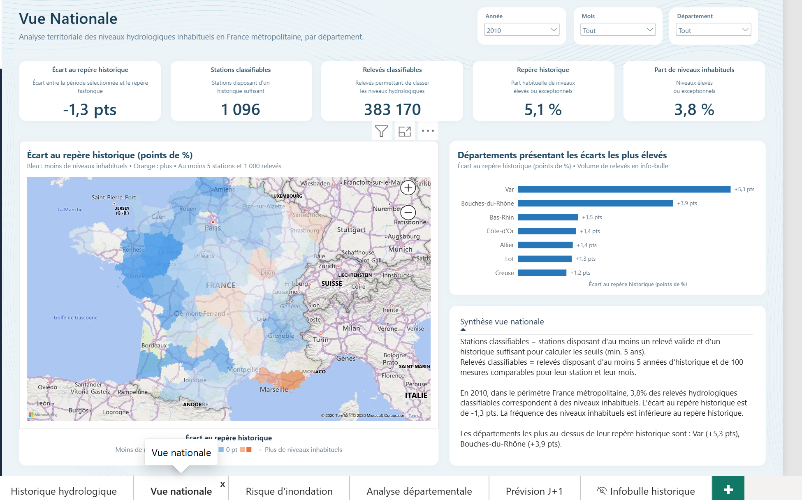
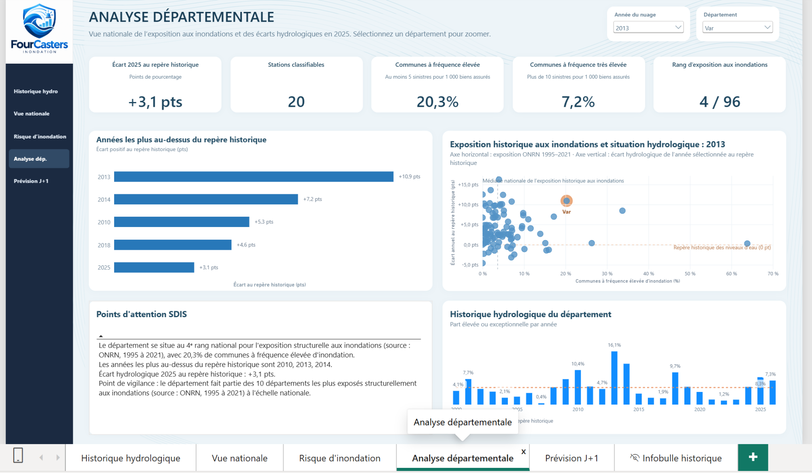
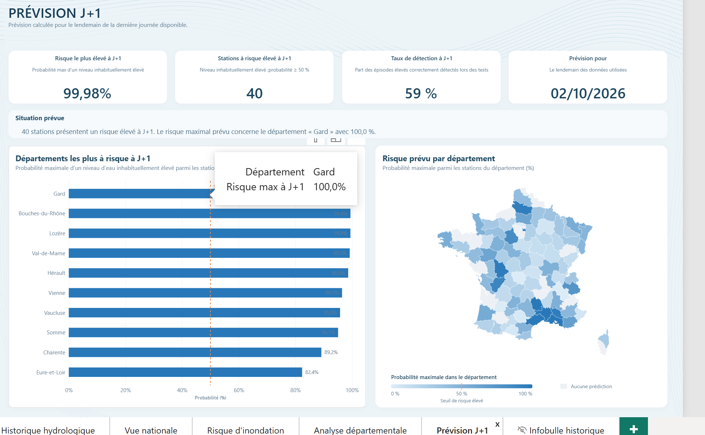
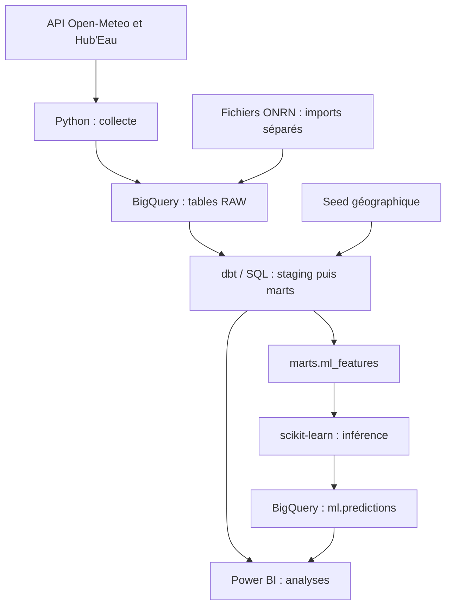
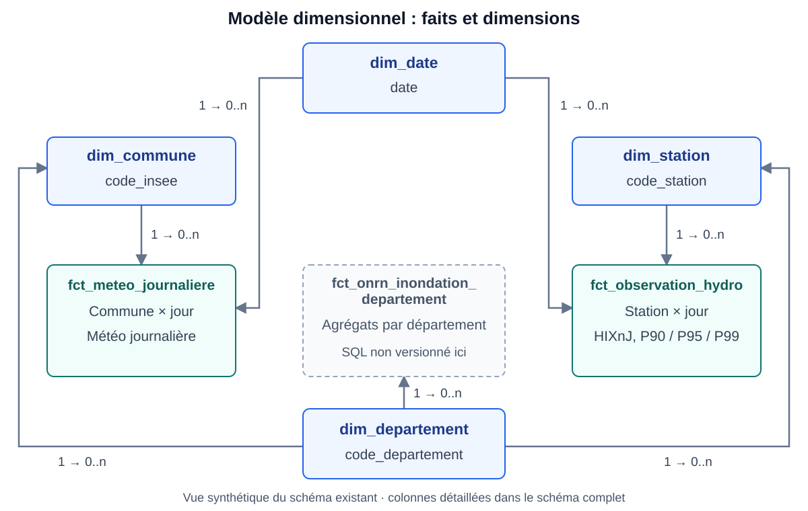

# FourCasters | Du traitement de données à l'aide à la décision

**Un pipeline de données automatisé, de la collecte aux tableaux de bord et à la prédiction.**

Python · SQL · BigQuery · dbt · GitHub Actions · scikit-learn · Power BI

[Voir le dashboard](#le-résultat--un-tableau-de-bord-power-bi) · [Compétences et usages PME](#compétences-et-valeur-démontrées) · [Documentation technique](#documentation-technique)

FourCasters est une **preuve de concept (PoC) en Data Engineering, Business Intelligence et Machine Learning**, appliquée aux risques naturels en France.

**Problème traité :** les observations hydrologiques, la météo et l'historique des sinistres sont dispersés dans plusieurs sources, avec des formats et des périmètres différents.

**Solution développée :** réunir ces données publiques dans BigQuery, automatiser la collecte des API et les transformations SQL/dbt, contrôler leur qualité, puis produire des indicateurs consultables dans Power BI. Une brique de machine learning complète l'analyse avec une estimation de dépassement de seuil hydrologique à J+1.

**Ce que démontre ce projet :** la capacité à concevoir une chaîne de données de bout en bout, avec une restitution destinée à guider l'analyse.

*Projet collectif réalisé dans le cadre de la formation Data Analyst de la Wild Code School.*

## Le résultat : un tableau de bord Power BI

### Vue nationale



*Capture du 08/10/2026. Exemple de lecture sur l'année 2010 : carte des écarts au repère historique, indicateurs de couverture et comparaison des départements.*

<details>
<summary><strong>Voir aussi l'analyse départementale et la prévision J+1</strong></summary>

### Analyse départementale



*Capture du 08/10/2026. Département sélectionné : Var. Le nuage compare l'exposition historique ONRN 1995–2021 à la situation hydrologique de 2013 ; le bandeau présente l'écart de 2025.*

### Prévision J+1



*Capture du 09/10/2026. Données utilisées au 01/10/2026, prévision pour le 02/10/2026. Les scores concernent un dépassement de niveau hydrologique ; ils ne mesurent pas une probabilité de dommages. Le périmètre exact du KPI de 59 % est détaillé dans la section Machine learning.*

</details>

Ces trois images sont des **captures réelles de Power BI**, conservées sans modification de leur contenu. Elles illustrent des états datés et des filtres précis.

Le tableau de bord rassemble cinq angles d'analyse :

- **Historique hydrologique :** évolution des niveaux mesurés et comparaison avec des repères historiques.
- **Vue nationale :** synthèse des observations et comparaison géographique.
- **Analyse départementale :** exploration des différences entre territoires.
- **Risque d'inondation :** exploitation de données historiques publiques de l'ONRN.
- **Prévision J+1 :** estimation, station par station, de dépassements de niveaux élevés à partir des dernières données consolidées.

L'objectif est de passer de plusieurs jeux de données et traitements techniques à une **lecture opérationnelle plus simple** : indicateurs, cartes, graphiques et filtres interactifs.

> **Lecture du J+1 :** l'ingestion applique un **recul de sept jours**. La prévision cible le lendemain de la **dernière date exploitable**, avec un décalage supplémentaire possible si des observations manquent. FourCasters constitue une preuve de concept d'analyse, sans fonction d'alerte officielle ou en temps réel.

## Chiffres clés du projet

| Indicateur | Résultat |
| --- | --- |
| Données de variables ML | **1 796 900 lignes** |
| Couverture du jeu ML historique | **247 stations hydrométriques** |
| Objectif du modèle | Détecter un dépassement du seuil historique **P95 à J+1** |
| Rappel des nouveaux franchissements sur le jeu de test | **59 %**, lorsque la station est sous le P95 à J puis atteint ou dépasse le seuil à J+1 |

*État au **07/10/2026** : jeu ML couvrant le **01/01/2000 au 30/09/2026**. Les 247 stations correspondent au périmètre ML historique ; la couverture du dashboard et celle d'un lot quotidien peuvent différer. Le rappel de 59 % est une évaluation rétrospective, sans garantie de performance en exploitation.*

## Compétences et valeur démontrées

| Besoin | Réalisation dans FourCasters |
| --- | --- |
| **Regrouper des données hétérogènes** | API Open-Meteo et Hub'Eau, fichiers publics ONRN et référentiels géographiques |
| **Réduire les opérations manuelles récurrentes** | Scripts Python et exécution planifiée par GitHub Actions |
| **Améliorer la fiabilité des traitements** | Contrôles des réponses API, gestion d'erreurs, déduplication et tests dbt |
| **Rendre les données exploitables** | Modélisation SQL/dbt dans BigQuery et restitution Power BI |
| **Explorer un usage prédictif** | Pipeline de classification avec scikit-learn et publication des résultats dans BigQuery |

### Applications possibles dans une PME

| Domaine | Transposition possible de la méthode |
| --- | --- |
| Production industrielle | Consolider des fichiers de production et rendre les écarts consultables dans un tableau de bord |
| Qualité / HSE | Harmoniser les relevés et suivre les indicateurs de non-conformité ou d'incident |
| Logistique | Rapprocher des exports métier et suivre les retards, volumes ou écarts de stock |

Ces applications sont des **pistes de transposition**. Le cas développé et évalué dans FourCasters concerne les données publiques hydrologiques et météorologiques.

## Documentation technique

### Architecture



**GitHub Actions** orchestre la collecte API, `dbt run`, les tests de `ml_features`, puis l'inférence. Les imports ONRN et la préparation de l'historique sont séparés du traitement quotidien. Le code versionné comporte les couches **staging** et **marts**.

### Modèle de données : faits et dimensions



**[Ouvrir cette vue en taille réelle](https://raw.githubusercontent.com/eddy370/FourCasters/main/docs/images/schema-dimensionnel.svg)** · **[Consulter toutes les colonnes en taille réelle](https://raw.githubusercontent.com/eddy370/FourCasters/main/docs/images/schema-complet.svg)**

Les faits météo et hydrologiques s'appuient sur des dimensions pour les analyses par date, commune et station. La dimension département complète la hiérarchie géographique. Cette vue résume les relations du [schéma détaillé existant](docs/schema_bdd.svg) ; elle ne représente pas l'ensemble du pipeline ou des tables ML.

Le schéma inclut aussi `fct_onrn_inondation_departement`, dont le modèle SQL n'est pas versionné ici. Cette table est distinguée dans la vue ; sa présence ne garantit pas sa reproduction depuis le dépôt.

### Sources réellement utilisées

| Source | Contenu exploité | Mode de chargement |
| --- | --- | --- |
| Open-Meteo | Météo journalière historique, pluie et humidité du sol ; `era5_seamless` pour les mises à jour | API dans [src/openmeteo.py](src/openmeteo.py) ; historique préchargé distinct |
| Hub'Eau | Référentiel des stations et observations HIXnJ, hauteur instantanée maximale journalière | API avec pagination dans [src/hubeau.py](src/hubeau.py) |
| ONRN | Classes communales de fréquence des sinistres d'inondation et de représentativité, historique 1995–2021 | Fichiers publics importés dans BigQuery, puis [nettoyés en staging](fourcasters/models/staging/onrn/) |
| Référentiel géographique | Communes, codes INSEE, départements et coordonnées | [CSV versionné comme seed dbt](fourcasters/seeds/referentiel_geographique.csv) |

### Technologies et code à consulter

| Technologie | Rôle | Point d'entrée |
| --- | --- | --- |
| Python / requests / pandas | Collecte, vérification des réponses, préparation des lignes et inférence | [load_data.py](load_data.py), [src/](src/) |
| BigQuery | Stockage RAW, transformations SQL et tables de restitution | [src/bigquery_utils.py](src/bigquery_utils.py) |
| dbt | Dépendances entre modèles, matérialisation et tests | [fourcasters/dbt_project.yml](fourcasters/dbt_project.yml), [models/](fourcasters/models/) |
| GitHub Actions | Exécution planifiée et déclenchement manuel | [.github/workflows/pipeline.yml](.github/workflows/pipeline.yml) |
| scikit-learn / joblib | Chargement du pipeline entraîné et classification | [predict.py](predict.py), [modèle sauvegardé](fourcasters_logistic_regression.pkl) |
| Power BI | Cartes, indicateurs, exploration historique et lecture des prédictions | Captures ci-dessus ; `ml.predictions` consommée en DirectQuery |

### Transformations SQL/dbt

Les transformations rendent les données comparables avant leur restitution :

- **Dernière version par clé métier :** `ROW_NUMBER()` ordonné par date d'insertion dans les stagings [météo](fourcasters/models/staging/openmeteo/stg_openmeteo.sql) et [hydrologie](fourcasters/models/staging/hubeau/stg_hubeau_obs_elab.sql). Une correction reçue en RAW remplace ainsi la version retenue pour l'analyse.
- **Normalisation :** conversions de dates et types avec `SAFE_CAST`, nettoyage des libellés et codes INSEE sur cinq caractères. Le staging météo réunit l'historique avant le 01/08/2026 et les mises à jour à partir de cette date.
- **ONRN :** exclusion des lignes sans code INSEE et de l'en-tête importé comme donnée ; conservation des classes de fréquence et de représentativité dans deux modèles distincts.
- **Tables de faits :** [météo journalière](fourcasters/models/marts/fct_meteo_journaliere.sql) et [observations hydrologiques](fourcasters/models/marts/fct_observation_hydro.sql), avec traitement incrémental sur une fenêtre de révision de 35 jours, partitionnement mensuel et clustering par commune ou station.
- **Repères hydrologiques :** P90, P95 et P99 calculés par station et mois avec `APPROX_QUANTILES`, à partir des observations de qualification `20` et de statut `12` ou `16`. La classification du mart distingue les niveaux normaux, élevés et exceptionnels, avec au moins cinq années distinctes de référence.
- **Variables ML :** jointure hydrologie–météo par commune et date, calculs de variation et de cumul de pluie, puis cible J+1 dans [ml_features.sql](fourcasters/models/marts/ml_features.sql). Les jours sans cible future restent disponibles pour l'inférence ; l'entraînement les exclut.

### Automatisation et traçabilité

[run_pipeline.py](run_pipeline.py) enchaîne quatre étapes :

1. Collecte des API vers les tables RAW.
2. Exécution des modèles avec `dbt run`.
3. Contrôle de `ml_features` avec `dbt test --select ml_features`.
4. Prédiction et écriture dans BigQuery.

Une exception ou un échec dbt arrête la chaîne. La collecte comprend des tentatives supplémentaires, des délais d'attente et une gestion des limitations d'appels. Les lignes chargées portent un `batch_id`, une date d'insertion et une empreinte de contenu SHA-256. Le code prévoit l'annulation du lot de la source concernée en cas d'échec de son ingestion.

[predict.py](predict.py) sélectionne uniquement `MAX(date)` dans `marts.ml_features`. Un `MERGE` sur **date des données × station** met à jour les prédictions rejouées et conserve les lots précédents. La date de calcul est enregistrée séparément ; la date cible correspond à la date des données + un jour.

Le [workflow](.github/workflows/pipeline.yml) prévoit un déclenchement quotidien et manuel, avec une seule exécution à la fois. La réussite d'un traitement actualise les tables BigQuery ; elle ne démontre pas à elle seule que tous les visuels Power BI ont été rechargés.

### Machine learning

**Objectif :** prédire si la hauteur maximale journalière d'une station atteint ou dépasse son **P95 historique à J+1**. Ce percentile constitue un repère statistique propre à la station et au mois.

Le pipeline sauvegardé associe **imputation médiane → standardisation → régression logistique**, avec `class_weight="balanced"` pour tenir compte de la rareté des dépassements. Ce choix fournit une base rapide et interprétable ; il augmente la sensibilité au prix de fausses détections.

L'inférence utilise exactement cinq variables :

| Variable | Calcul ou origine |
| --- | --- |
| `position_p95` | `(hauteur_j - P95) / (P99 - P90)` |
| `variation_position_1j` | Écart de position entre J et J−1, si les deux jours sont consécutifs |
| `pluie_j` | Pluie journalière de la commune de la station |
| `pluie_3j` | Cumul de pluie sur la fenêtre J−2 à J |
| `humidite_sol` | Humidité du sol à 7–28 cm |

Le champ `mois` est présent dans la table de variables mais ne fait pas partie des cinq entrées du classifieur. La cible `target_j1` utilise `LEAD` et exige que l'observation suivante soit exactement à J+1.

**Évaluation datée :** le notebook de retest du **07/10/2026** utilise une séparation chronologique, avec entraînement avant le 01/01/2023 et test à partir de cette date. Il rapporte **1 528 444 lignes d'entraînement** et **266 678 lignes de test** avec cible renseignée.

Le KPI de **59 %** correspond aux **nouveaux franchissements** : station sous le P95 à J, puis au-dessus ou au seuil à J+1. Le retest compte **3 007 franchissements détectés sur 5 080**, soit 59,19 %, arrondi à 59 % dans la présentation. Sur ce même périmètre, la précision est de **10,6 %** et le F1 de **17,9 %** : de nombreuses détections sont donc des faux positifs. Ce KPI ne doit pas être étendu à tous les jours déjà au-dessus du seuil.

*Ces résultats proviennent des notebooks de travail du projet, absents de ce dépôt. Le fichier de modèle est versionné ; le protocole d'entraînement et ces métriques ne sont pas encore entièrement reproductibles depuis GitHub.*

### Tests et qualité

Le dépôt contient des tests dbt de **non-nullité, unicité et relations** dans les fichiers YAML, ainsi que deux contrôles SQL spécifiques :

- [Unicité station × date](fourcasters/tests/assert_ml_features_unique_station_date.sql).
- [Présence d'au moins une ligne exploitable à la dernière date](fourcasters/tests/assert_ml_features_derniere_date_inferable.sql).

**Périmètre automatisé :** `run_pipeline.py` exécute les tests sélectionnés sur `ml_features` avant l'inférence. Les autres tests dbt sont définis mais demandent une exécution explicite de `dbt test`. Ces contrôles détectent certaines anomalies ; ils ne garantissent pas l'absence d'erreurs ni la complétude de toutes les stations.

### Limites à connaître

- **Fraîcheur :** recul d'ingestion de sept jours, augmenté si les données nécessaires au ML sont indisponibles. J+1 peut donc correspondre à une date déjà passée au moment de la consultation.
- **Couverture :** périmètres hydrologique, météo et ML différents ; les 247 stations historiques du ML ne représentent pas tout le réseau national, et toutes ne sont pas présentes dans chaque lot.
- **Interprétation :** un dépassement du P95 ne suffit pas à établir une inondation. Le modèle ne prédit ni routes coupées, ni dommages matériels, ni risque à une adresse précise.
- **Évaluation :** les seuils du modèle dbt sont calculés sur l'ensemble de l'historique disponible. Une validation prospective avec seuils calculés uniquement sur le passé reste nécessaire pour mesurer une performance réellement prédictive.
- **Scores :** les probabilités du classifieur pondéré ne disposent pas d'une calibration démontrée ; le seuil de décision et les faux positifs demandent une validation métier.
- **Reproduction :** imports historiques, notebooks d'entraînement, fichier Power BI et certains marts ONRN ne sont pas intégralement versionnés ici. Les noms de ressources GCP sont liés à l'environnement du projet.

### Installation et reproduction

#### Prérequis

- **Python 3.12**, version utilisée par le workflow, et les dépendances de [requirements.txt](requirements.txt).
- Un compte de service GCP avec accès aux ressources BigQuery nécessaires, configuré via `GOOGLE_APPLICATION_CREDENTIALS`.
- Le profil dbt `fourcasters` dans `~/.dbt/profiles.yml`.
- Les datasets et tables attendus par les [sources dbt](fourcasters/models/staging/), notamment l'historique `raw_openmeteo.open_meteo_corrigé` et les deux imports `raw_onrn`.
- Le référentiel géographique chargé comme seed et les observations hydrologiques historiques préparées. Le traitement quotidien couvre une fenêtre récente ; il ne reconstruit pas tout l'historique depuis 2000.
- La table de destination `ml.predictions`, créée selon `SCHEMA_PREDICTIONS` dans [predict.py](predict.py). Le fichier `fourcasters_logistic_regression.pkl` est déjà fourni dans le dépôt.

**Périmètre de reproduction :** les instructions ci-dessous ciblent l'environnement FourCasters. Pour un autre compte GCP, il faut d'abord adapter les identifiants de projet et de tables présents dans les scripts et les sources dbt, puis préparer les données historiques. Le fichier Power BI n'est pas publié dans ce dépôt ; les captures montrent le résultat sans permettre de reconstruire les pages et mesures.

#### Installation

```bash
git clone https://github.com/eddy370/FourCasters.git
cd FourCasters
python -m venv .venv
```

Activer l'environnement avant d'installer les dépendances :

| Système / shell | Commande |
| --- | --- |
| macOS ou Linux / bash | `source .venv/bin/activate` |
| Windows / PowerShell | `.\\.venv\\Scripts\\Activate.ps1` |

```bash
pip install -r requirements.txt
```

Configurer `GOOGLE_APPLICATION_CREDENTIALS` avec le chemin absolu d'une clé locale, conservée hors du dépôt. Exemple de profil dbt, reprenant les paramètres du workflow :

```yaml
fourcasters:
  target: dev
  outputs:
    dev:
      type: bigquery
      method: service-account
      project: projet-les-fourcasters
      dataset: dbt_dev
      location: US
      keyfile: "{{ env_var('GOOGLE_APPLICATION_CREDENTIALS') }}"
```

#### Exécution

Une fois les ressources et imports préparés, depuis la racine du dépôt :

```bash
dbt debug --project-dir fourcasters
dbt seed --project-dir fourcasters
python run_pipeline.py
```

Pour lancer l'ensemble des tests définis après construction des modèles :

```bash
dbt test --project-dir fourcasters
```

**Vérification attendue :** connexion dbt valide, quatre étapes du pipeline terminées sans erreur, tests ML réussis et nombre de prédictions écrites journalisé. Les logs distinguent les dernières dates RAW, la date des variables et la date J+1 ciblée. Ces commandes effectuent des lectures et écritures BigQuery et peuvent entraîner des coûts.

Pour GitHub Actions, le workflow attend le secret `GCP_SA_KEY` et configure le profil dbt au lancement. Ne jamais publier de clé de service dans Git.

### Organisation du dépôt et points d'entrée

| Chemin | Contenu |
| --- | --- |
| [.github/workflows/](.github/workflows/) | Planification et exécution du pipeline |
| [src/](src/) | Connecteurs API et utilitaires BigQuery |
| [fourcasters/models/](fourcasters/models/) | Transformations staging et marts |
| [fourcasters/seeds/](fourcasters/seeds/) | Référentiel géographique |
| [fourcasters/tests/](fourcasters/tests/) | Contrôles SQL des variables ML |
| [notebooks/](notebooks/) | Exploration Open-Meteo versionnée |
| [docs/](docs/) | Documents du projet et schéma des tables |
| [docs/images/](docs/images/) | Captures Power BI du portfolio |
| [load_data.py](load_data.py) | Orchestration de la collecte |
| [run_pipeline.py](run_pipeline.py) | Pipeline de bout en bout |
| [predict.py](predict.py) | Inférence et écriture des prédictions |
| [requirements.txt](requirements.txt) | Versions des dépendances Python |

## Contexte du projet

FourCasters est un **projet collectif réalisé dans le cadre de la formation Data Analyst de la Wild Code School**. Il présente une méthode de travail et des compétences techniques acquises et mises en pratique dans un cadre de formation.

Ce dépôt documente le code et l'architecture. Les résultats et métriques sont présentés avec leur date ou leur périmètre d'évaluation pour éviter de les confondre avec des garanties opérationnelles.
