# FourCasters

FourCasters est un projet de collecte et d'analyse de données liées aux risques naturels en France.  
Il centralise plusieurs sources de données publiques dans BigQuery, les transforme avec dbt et les exploite dans un tableau de bord décisionnel.

## Prérequis

- Python 3.11
- Un compte Google Cloud Platform
- Un projet Google Cloud avec BigQuery activé
- Une clé de compte de service permettant l'accès à BigQuery
- dbt avec l'adaptateur BigQuery
- Git

## Installation

Cloner le dépôt :

```bash
git clone <URL_DU_DEPOT>
cd <NOM_DU_DEPOT>
```

Créer et activer un environnement virtuel :

```bash
python -m venv .venv
```

Installer les dépendances :

```bash
pip install -r requirements.txt
```

Configurer ensuite :

- la clé de service Google Cloud pour l'accès à BigQuery ;
- le fichier `profiles.yml` utilisé par dbt.

## Utilisation

Lancer le pipeline avec :

```bash
python run_pipeline.py
```

Cette commande lance l'ingestion des données dans BigQuery puis les transformations dbt.

Le pipeline peut également être exécuté automatiquement avec GitHub Actions.

## Structure du projet

```text
FourCasters/
│
├── fourcasters/
│   ├── models/
│   │   ├── staging/
│   │   ├── intermediate/
│   │   └── marts/
│   ├── seeds/
│   └── dbt_project.yml
│
├── script/
│
├── docs/
│   └── schema_bdd.svg
│
├── .github/
│   └── workflows/
│
├── load_data.py
├── run_pipeline.py
├── requirements.txt
└── README.md
```

Principaux éléments :

- `load_data.py` : ingestion et chargement des données dans BigQuery.
- `run_pipeline.py` : orchestration de l'ingestion et des transformations dbt.
- `fourcasters/models/staging/` : nettoyage et standardisation des données sources.
- `fourcasters/models/intermediate/` : transformations et enrichissements intermédiaires.
- `fourcasters/models/marts/` : tables finales utilisées pour l'analyse et le tableau de bord.
- `fourcasters/seeds/` : données de référence utilisées par dbt.
- `.github/workflows/` : automatisation du pipeline avec GitHub Actions.
- `docs/` : documentation du projet et schéma du modèle de données.

## Modèle de données

Le schéma ci-dessous présente les principales tables du projet et leurs relations.

<p align="center">
  
</p>

## Sources de données

- **Open-Meteo** : données météorologiques.
- **Hub'Eau** : données hydrologiques et observations des cours d'eau.
- **ONRN** : données relatives aux risques naturels, notamment les inondations.
- **Référentiels géographiques** : données permettant d'identifier et d'enrichir les communes et départements français.

Les données sont chargées dans **Google BigQuery**, puis nettoyées et transformées avec **dbt** avant leur utilisation dans le tableau de bord.

## Contact

Projet réalisé dans le cadre de la formation Data Analyst de la Wild Code School.

